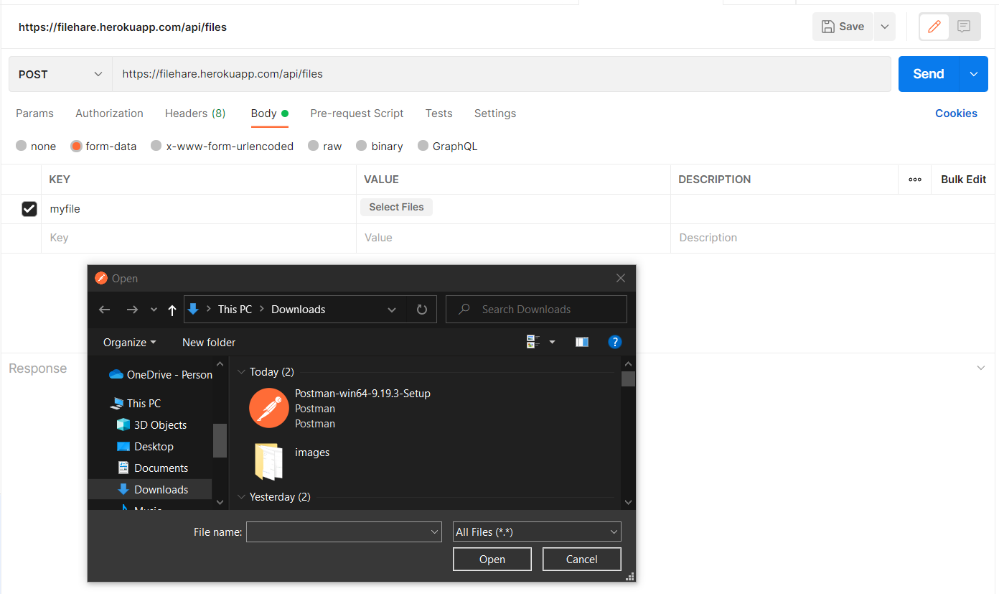
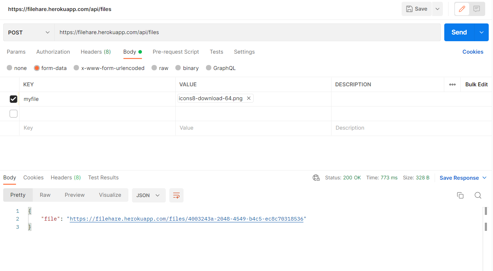
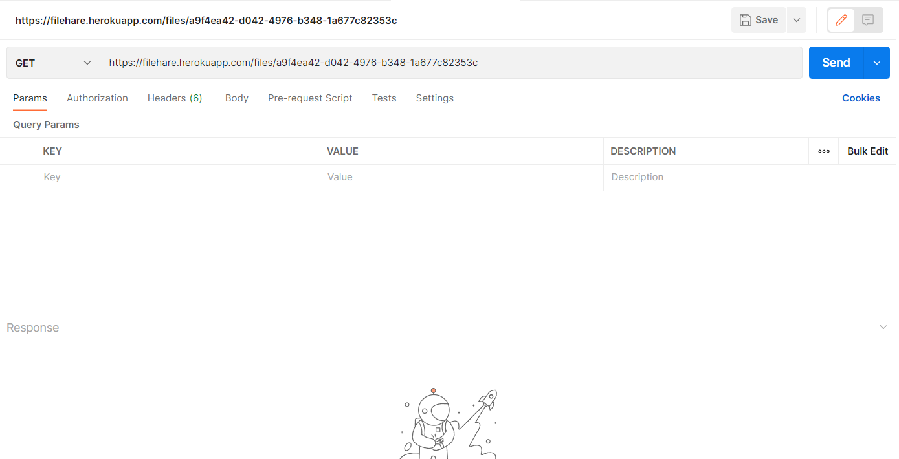
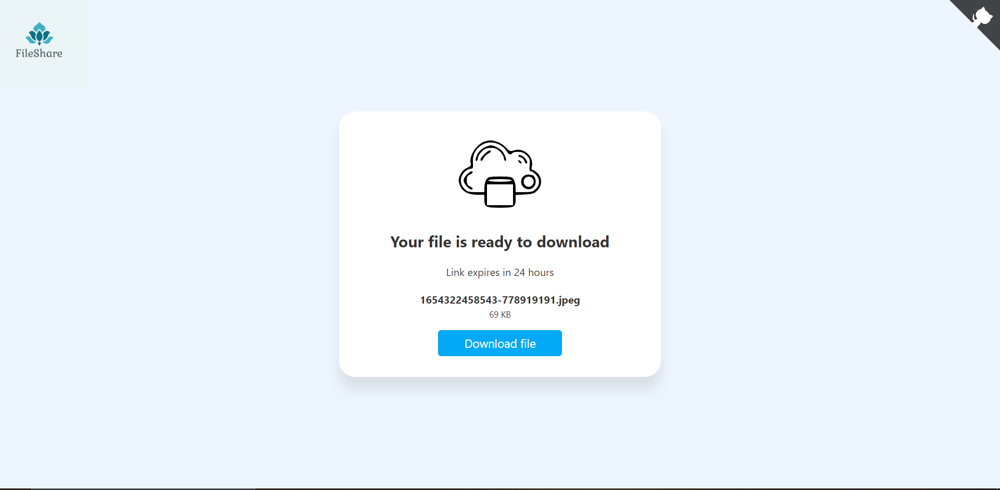
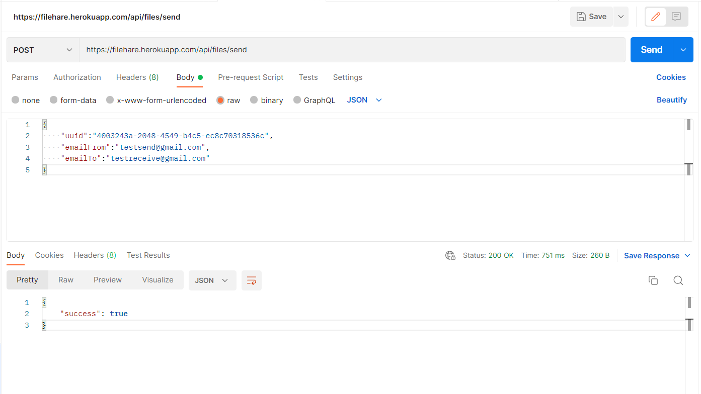

# FileShare

Created FileShare backend using nodejs,mongoose and expressjs
with this api you can transfer any type of file to your friend
you can transfer files one mail to other,to transfer file using
email i have used nodemailer library and sendinblue.


## API Reference
to use this link pls install postman.

#### post file
copy below link and paste link in postman and create post request
after creating request a download link will be generated





```http
  post https://filehare.herokuapp.com/api/files
```

#### Get
with uuid a download link is generated 



```http
  GET https://filehare.herokuapp.com/files/uuid
```
#### Get
to send a file to any email create post request in postman


```http
  post https://filehare.herokuapp.com/api/files/send
```

## Deployment

App is deployed on heroku.

```

